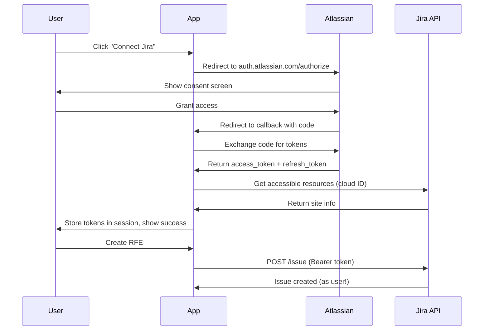

# Jira OAuth 2.0 Setup Guide

This guide walks you through setting up per-user Jira authentication using OAuth 2.0 (3LO - three-legged OAuth).

## What You'll Get

- **Per-user authentication**: Each user authenticates with their own Atlassian account
- **RFEs created as actual user**: Issues appear with correct creator (not a bot account)
- **Automatic token refresh**: Tokens refresh automatically, users stay logged in for 90 days
- **Secure**: Tokens stored in HTTP-only session cookies

## Time Required

**10-15 minutes**

---

## Step 1: Create OAuth 2.0 App in Atlassian

### 1.1 Go to Atlassian Developer Console

Open: https://developer.atlassian.com/console/myapps/

Click **"Create"** → **"OAuth 2.0 integration"**

### 1.2 Configure Basic Settings

- **Name**: "Org Pulse" (or your app name)
- **Description**: "Engineering dashboard for team tracking and customer insights"

Click **"Create"**

### 1.3 Configure Permissions

Click **"Permissions"** tab →  **"Add"** → **"Jira API"**

Add these scopes:
- ☑️ `write:jira-work` (Create and edit issues)
- ☑️ `read:jira-user` (Read user information)
- ☑️ `offline_access` (Get refresh tokens)

Click **"Save"**

### 1.4 Configure Authorization

Click **"Authorization"** tab

**Callback URL:**
- **Local dev**: `http://localhost:3001/api/modules/customer-insights/auth/jira/callback`
- **Production**: `https://your-domain.com/api/modules/customer-insights/auth/jira/callback`

**Important**: The callback URL must match EXACTLY (no trailing slash!)

For multiple environments, add all callback URLs:
```
http://localhost:3001/api/modules/customer-insights/auth/jira/callback
https://dev.example.com/api/modules/customer-insights/auth/jira/callback
https://prod.example.com/api/modules/customer-insights/auth/jira/callback
```

Click **"Save changes"**

### 1.5 Get Credentials

Click **"Settings"** tab

Copy these values:
- **Client ID**: `ari:cloud:platform::app/...` (long string)
- **Secret**: Click **"New secret"**, copy the generated value

---

## Step 2: Add Credentials to Your Environment

### Local Development

Edit `.env.local` (or `.env`):

```bash
# Jira OAuth 2.0 (per-user authentication)
JIRA_OAUTH_CLIENT_ID=ari:cloud:platform::app/xxxxxxxx-xxxx-xxxx-xxxx-xxxxxxxxxxxx
JIRA_OAUTH_CLIENT_SECRET=ATOAxxxxxxxxxxxxxxxxxxxxxxxxxxxxx
```

**Security Note**: Never commit these to git! `.env` and `.env.local` are gitignored.

### Production Deployment

Add to OpenShift secrets (or your deployment platform):

```bash
JIRA_OAUTH_CLIENT_ID=ari:cloud:platform::app/...
JIRA_OAUTH_CLIENT_SECRET=ATOAxxxxxxx...
```

---

## Step 3: Install Session Middleware (If Not Already Done)

Jira OAuth requires session storage for CSRF protection and token storage.

### 3.1 Install express-session

```bash
npm install express-session
```

### 3.2 Add Session Middleware

Edit `server/dev-server.js`, add after line ~176 (after `app.use(express.json())`):

```javascript
// Session support for OAuth (Google Drive + Jira per-user auth)
const session = require('express-session');
app.use(session({
  secret: process.env.SESSION_SECRET || 'dev-secret-change-in-production-' + Date.now(),
  resave: false,
  saveUninitialized: false,
  cookie: {
    secure: process.env.NODE_ENV === 'production', // HTTPS only in prod
    httpOnly: true,
    maxAge: 90 * 24 * 60 * 60 * 1000 // 90 days (matches Jira refresh token lifetime)
  }
}));
```

**Production**: Set `SESSION_SECRET` environment variable to a secure random value:

```bash
SESSION_SECRET=$(openssl rand -base64 32)
```

---

## Step 4: Restart the Server

```bash
# Stop server (Ctrl+C)
npm run dev:full
```

---

## Step 5: Test the OAuth Flow

### 5.1 Navigate to Customer Insights

Open: http://localhost:5173

Go to: **Customer Insights** → **RFE Creator**

### 5.2 Connect Jira Account

You should see a **"Connect Jira"** button.

Click it → OAuth popup opens

### 5.3 Grant Access

1. **Sign in** to your Atlassian account (if not already)
2. **Review permissions**: The app requests:
   - Create and edit Jira issues
   - Read your user information
   - Stay signed in (offline access)
3. **Click "Accept"**

### 5.4 Success!

Popup closes → You see **"✓ Connected to [Your Jira Site]"**

---

## Step 6: Create an RFE

Try creating an RFE:

1. Fill in the form (Title, Description, Component, Priority)
2. Click **"Create RFE"**
3. Success! The issue is created **as you** (not a bot)

Check Jira → The issue shows **you** as the creator/reporter.

---

## Troubleshooting

### "OAuth credentials not configured"

**Fix**: 
- Check `.env.local` has `JIRA_OAUTH_CLIENT_ID` and `JIRA_OAUTH_CLIENT_SECRET`
- Restart server: `npm run dev:full`

### "Redirect URI mismatch"

**Fix**:
- In Atlassian Developer Console → **Authorization** tab
- Make sure callback URL is EXACTLY: `http://localhost:3001/api/modules/customer-insights/auth/jira/callback`
- No trailing slash!
- Protocol must match (`http` for localhost, `https` for production)

### "Session is not defined"

**Fix**:
- Run: `npm install express-session`
- Add session middleware to `server/dev-server.js` (see Step 3.2)
- Restart server

### "No accessible Jira sites found"

**Cause**: Your Atlassian account doesn't have access to any Jira Cloud sites.

**Fix**:
- Create a free Jira Cloud site: https://www.atlassian.com/software/jira/free
- Or ask your Jira admin to grant you access

### "Token refresh failed"

**Cause**: Refresh token expired (after 90 days of inactivity).

**Fix**:
- Click **"Connect Jira"** again
- Re-authenticate

---

## How It Works

### OAuth Flow



### Token Storage

- **Access token**: Valid for 1 hour
- **Refresh token**: Valid for 90 days of inactivity
- **Storage**: HTTP-only session cookie (not accessible to JavaScript)
- **Refresh**: Automatic when access token expires

### Rotating Refresh Tokens

Jira uses **rotating refresh tokens** for security:
- Each token refresh returns a **new refresh token**
- The old refresh token is **invalidated**
- App automatically updates stored token

---

## Per-User vs Shared Credentials

| Aspect | Per-User OAuth (This Setup) | Shared Credentials (Old Way) |
|--------|----------------------------|------------------------------|
| **Authentication** | Each user connects their own Atlassian account | One service account for all users |
| **Issue Creator** | Shows actual user | Shows bot/service account |
| **Security** | User permissions apply | Service account permissions apply |
| **Setup** | Requires OAuth app creation | Just API token |
| **Token Lifetime** | 90 days (auto-refresh) | Indefinite |

---

## Production Considerations

### Multi-Server Deployments

**Issue**: In-memory sessions don't work across multiple server instances.

**Solution**: Use Redis or similar for session storage:

```bash
npm install connect-redis redis
```

```javascript
const session = require('express-session');
const RedisStore = require('connect-redis').default;
const { createClient } = require('redis');

const redisClient = createClient({ url: process.env.REDIS_URL });
redisClient.connect();

app.use(session({
  store: new RedisStore({ client: redisClient }),
  secret: process.env.SESSION_SECRET,
  resave: false,
  saveUninitialized: false,
  cookie: { secure: true, httpOnly: true, maxAge: 90 * 24 * 60 * 60 * 1000 }
}));
```

### Environment-Specific OAuth Apps

**Best Practice**: Create separate OAuth apps for each environment:

- **Dev**: `http://localhost:3001/...` callback
- **Preprod**: `https://dev.example.com/...` callback
- **Prod**: `https://prod.example.com/...` callback

Each environment gets its own `JIRA_OAUTH_CLIENT_ID` and `JIRA_OAUTH_CLIENT_SECRET`.

### Session Secret Security

**Production**: Use a strong, random session secret:

```bash
# Generate secret
openssl rand -base64 32

# Add to environment
SESSION_SECRET=<generated-value>
```

**Never**:
- Hardcode the secret
- Commit it to git
- Use a timestamp (like `Date.now()`)

---

## References

- [Atlassian OAuth 2.0 (3LO) Documentation](https://developer.atlassian.com/cloud/jira/platform/oauth-2-3lo-apps/)
- [Jira Scopes Reference](https://developer.atlassian.com/cloud/jira/platform/scopes-for-oauth-2-3LO-and-forge-apps/)
- [Atlassian Developer Console](https://developer.atlassian.com/console/myapps/)

---

## Next Steps

Once Jira OAuth is working:

- ✅ Users can create RFEs as themselves
- ✅ No shared service account needed
- ✅ Tokens refresh automatically for 90 days

Consider also setting up:
- **Google Drive OAuth** (for CSV import from Drive)
- **Notification preferences** (get notified when RFEs are updated)
